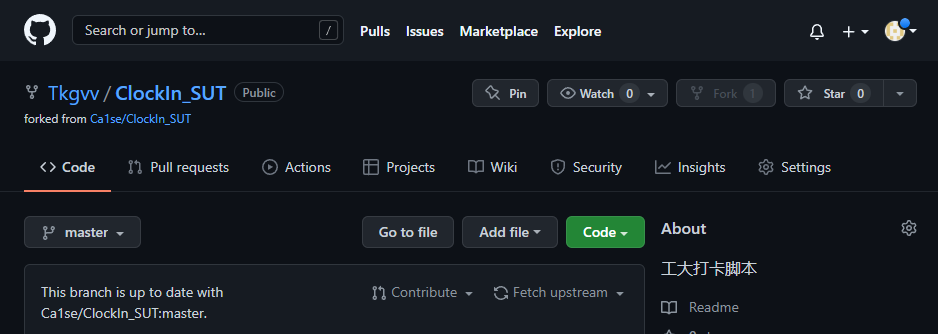
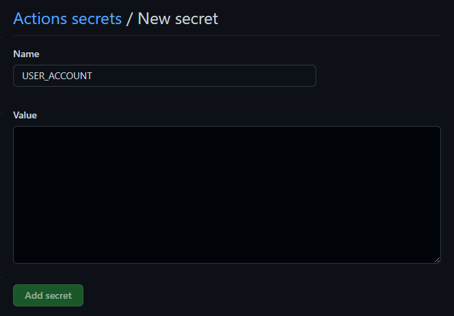
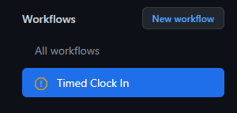
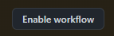
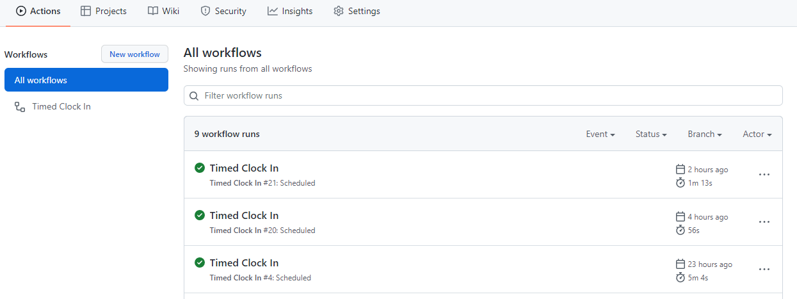

# ClockIn_SUT
这是一个适用于沈阳工业大学学生的疫情打卡脚本，现在已支持基于Github Action的自动定时打卡  
当你使用自动打卡，打卡脚本不在你电脑本地运行。
**当你使用手动打卡，运行该脚本时不要开启vpn**
## 责任须知
本项目仅供参考学习，使用本项目所带来的一切后果由使用者本人承担
## 原理
该脚本读取使用者前一天的打卡信息，并将获取的信息用于今天的打卡。这意味着当你的所在的位置变化时（例如假期回家或开学返校）时，你需要手动打一次卡更新你的位置信息

## 自动打卡（推荐）
1. [fork](https://github.com/Ca1se/ClockIn_SUT/fork) 这个库，你会在自己的账号下得到一个一模一样的库  

2. 点击你fork好的库的 Settings 选项  

3. 点击 Secrets 选项, 继续点击 Actions 选项  

4. 点击 New repository secret  

5. 在 Name 中填写 USER_ACCOUNT，在 Value 中填写你的打卡账号，然后点击 Add secret  

6. 再次点击 New repository secret，在 Name 中填写 USER_PASSWORD，在 Value 中填写你的打卡账号的密码，然后点击 Add secret
7. 点击你fork好的库的 Actions 选项，然后点击 I understand my workflows... 按钮  
  

8. 点击 Timed Clock in，然后点击右侧的 Enable workflow 按钮  
  

9. 所有设置已完成，你fork的仓库会在每天的上午11点47分，下午1点47分帮你自动打卡（实际打卡时间可能会由于Github Action的机制而延迟）。当你的仓库帮你打卡后，你可以在 Actions 选项下查看打卡结果。当由于某种原因打卡失败时，失败记录也将被记录在这里，并且Github会发送一封邮件到你注册Github的邮箱里告知你打卡失败

10. 当你不想再使用自动打卡时，只需要在 Settings 选项中删除fork的库就行了  


## 手动打卡
### windows
1. 在python官网的[下载页](https://www.python.org/downloads/)下载最新版本的python安装包并安装，并确保将python加入到了环境变量path中
2. 在powershell并输入以下命令并等待命令执行完毕
```
    python -m pip install requests
```
3. 下载该脚本
4. 使用python运行该脚本, 该脚本需要获取你打卡要使用的账号和密码  
你可以在开始运行该脚本时将账号和密码传入脚本，或者直接运行脚本，当脚本提示输入账号和密码时输入对应信息
```
    # 在开始运行脚本时将账号和密码传入脚本(假设账号为123456，密码为456789), 使用该方法不会将你的账号密码保存在你的电脑
    python main.py -u 123456 -p 456789
    # 或者直接运行脚本，根据提示输入账号和密码，使用该方法会将你的账号密码储存在你的电脑上，在下次运行该脚本时脚本将直接读取储存的账号和密码
    python main.py
    # 当显示 account: 时,输入账号并回车
    account:123456
    # 当显示 password: 时,输入密码并回车（注意，在输入密码时，你无法看到你输入的内容）
    password:
``` 
5. 等待脚本运行完成，当脚本显示'Success'时，打卡成功。

### Linux
1. 安装python3与python的requests包
```
    # 以ubuntu为例
    sudo apt install python3.9 python3-requests
```
2. 下载该脚本
3. 使用python运行该脚本, 该脚本需要获取你打卡要使用的账号和密码  
你可以在开始运行该脚本时将账号和密码传入脚本，或者直接运行脚本，当脚本提示输入账号和密码时输入对应信息
```
    # 在开始运行脚本时将账号和密码传入脚本(假设账号为123456，密码为456789), 使用该方法不会将你的账号密码保存在你的电脑
    python main.py -u 123456 -p 456789
    # 或者直接运行脚本，根据提示输入账号和密码，使用该方法会将你的账号密码储存在你的电脑上，在下次运行该脚本时脚本将直接读取储存的账号和密码
    python main.py
    # 当显示 account: 时,输入账号并回车
    account:123456
    # 当显示 password: 时,输入密码并回车（注意，在输入密码时，你无法看到你输入的内容）
    password:
``` 
4. 等待脚本运行完成，当脚本显示'Success'时，打卡成功。

## 更新信息
### 2021.02.03 更新
添加提示"昨日未打卡的错误提示"

### 2021.02.16 更新
添加对意外异常的捕获, 现在脚本在遇到一些异常情况时不会直接退出而是打印异常

### 2021.04.30 更新
添加网络链接失败后重试选项

### 2021.10.04 更新
修复无法打卡问题

### 2022.4.26 更新
添加基于Github Action的自动打卡功能
